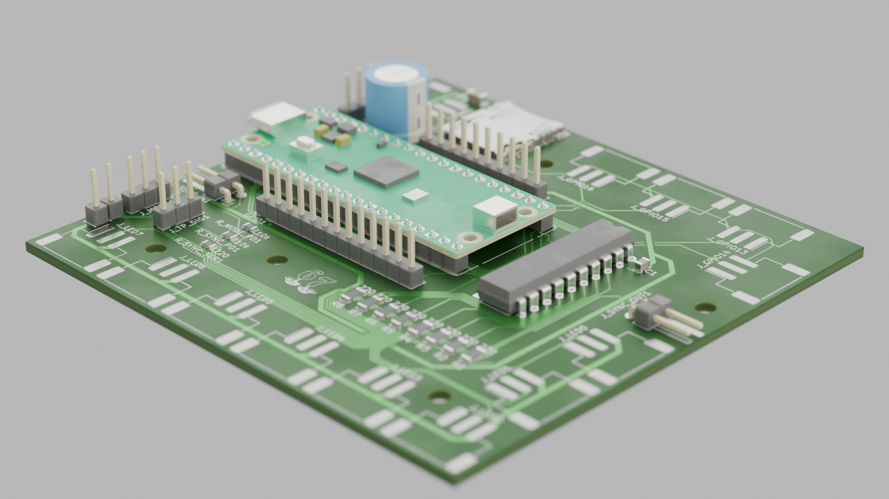
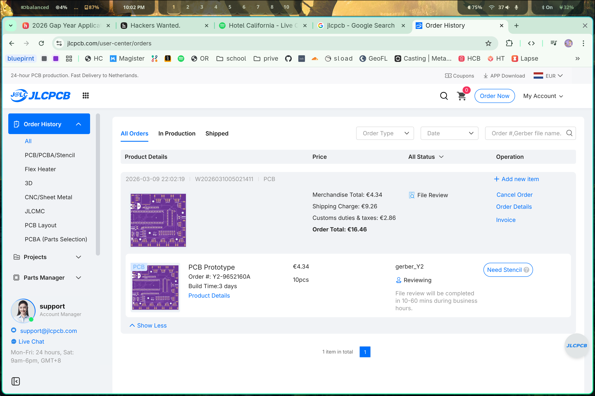
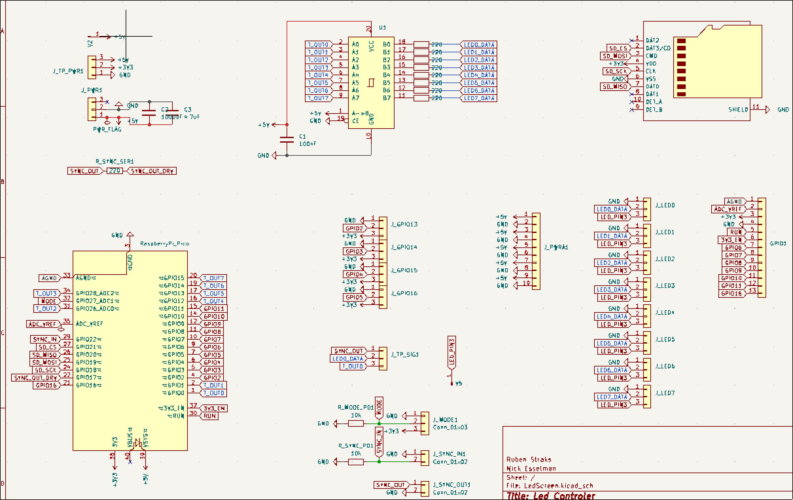

# Led Control Board
Status: PCB designed, DRC clean, awaiting fabrication.
This is a board to control up to 20, 16x16 LED matrix panels using xLights.

## Project Purpose

### Why I Built This
One of my close friends, Ruben, wanted to build a big LED panel project with me so we could display text, animations, and more.
After this board is fully working, I also want to use it in a deadmau5-style head build for Comic-Con. Shown in the video below

### What??
- Raspberry Pi Pico (RP2040) drives WS2812 LED panels.
- 74HCT245 shifts data from 3.3V logic to 5V logic.
- The board includes sync in/out so multiple boards can be chained.
- Animations can be played from an microSD card.
- LED power comes from an external regulated 5V PSU; the board is not intended to carry full LED current for large panel loads.

## Hardware Overview
- Main MCU/module: Raspberry Pi Pico (RP2040)
- The Power should come from an external regulated 5V PSU. 
- The board can route +5V to outputs, but high LED current should be delivered with separate power wiring if needed. For smaller Panel counts, the board is capable of connecting the 5V pin of the Panel output pins. Bridge the LED Power pins to do so.

## Repository Layout
```
/
├── README.md
├── gerber.zip
├── Gerber/
├── arduino_firmware/
├── bom/
└── src/
    ├── LedScreen.kicad_sch
    ├── LedScreen.kicad_pcb
    ├── LedScreen.kicad_pro
    └── LedScreen.wrl
```

## Special Files
- `gerber.zip` - JLCPCB archive
- `schematic.pdf` - Export from KiCad
- `cart.png` - Screenshot of JLCPCB checkout/cart.
- `src/LedScreen.wrl` - Exported 3D model from KiCad.

## Firmware / Software
The Pico runs my own firmware in the `arduino_firmware/` folder.
To Install:
1. Install the Earle Philhower Arduino-Pico core, 
2. Select `Raspberry Pi Pico`, 
3. Then upload the sketch from `arduino_firmware/`.
- If you need manual USB mass-storage mode, hold `BOOTSEL` while connecting USB before upload.

## Note
I also included an xLights example for controlling this board.
xLights configuration depends on the final data path used between xLights and the Pico.

Start with up to 3 daisy-chained panels per output lane while validating signal integrity and power behavior.

With 8 output lanes, that targets up to 24 panels total in a chained layout.
Use an external 5V PSU sized for the actual panel count and brightness.

## Bill of Materials
Interactive BOM: [cdn.nickesselman.nl](https://cdn.nickesselman.nl/ledpanel/ibom.html)

## Acknowledgements
- Ruben helped me brainstorm the idea and do the math on the power consumption
- My Dad for helping me figuer out the limits of the Pi Pico, And telling stories of Previous projects he did as a teenager my age

## License
- Hardware: CERN-OHL-S
- Firmware/Software: MIT License

Inspiration:
https://github.com/user-attachments/assets/429253ec-16dd-4379-a7f1-76a112b9e6f4

src/



