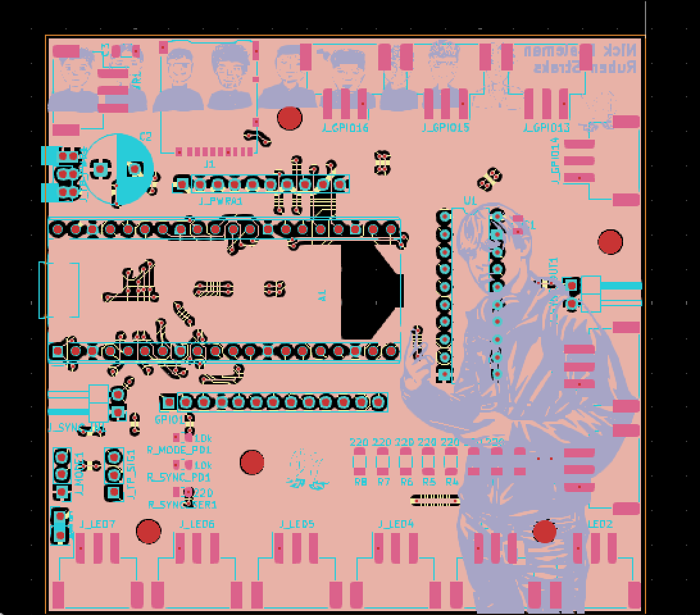
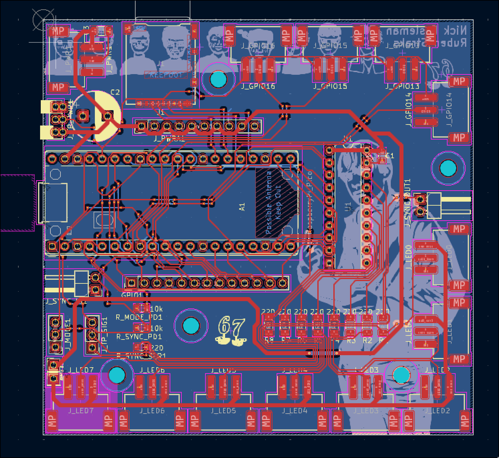

# Led Control Board

Status: I finished the hardware, soldering, and wiring up the board, and now I am working on the firmware.

This is a board to control multiple 16x16 WS2812 LED matrix panels using xLights.
The main idea is that I wanted one board that could handle the panel data, SD card playback, and syncing between boards without turning the whole thing into a wiring nightmare.

## Project Purpose

### Why I Built This
One of my close friends, Ruben, wanted to build a big LED panel project with me so we could display text, animations, and more.
After this board is fully working, I also want to use it in a deadmau5-style head build for Comic-Con. Shown in the video below.

### What??
- Raspberry Pi Pico (RP2040) drives WS2812 LED panels.
- 74HCT245 shifts data from 3.3V logic to 5V logic.
- The board includes sync in/out so multiple boards can be chained.
- Animations can be played from an microSD card.
- LED power comes from an external regulated 5V PSU; the board is not intended to carry full LED current for large panel loads.

## How do you use it?
If you want to update the code on the MCU, I would really suggest reading [The firmware instuctions](docs/FIRMWARE_INSTUCTIONS.md).
If you want to update the animations on the display, read [the animation instuctions](docs/ANIMATIONS_INSTUCTIONS.md).

The basic idea is:
1. Flash the Pico with the firmware from `arduino_firmware/RPI-PICO/`.
2. Put animation files on the SD card, or stream frames over USB from xLights.
3. Connect the LED panels and power them from an external regulated 5V PSU.
4. If needed, chain multiple boards together with the sync in/out headers.

## Hardware Overview
- Main MCU/module: Raspberry Pi Pico (RP2040)
- The power should come from an external regulated 5V PSU.
- The board can route +5V to outputs, but high LED current should be delivered with separate power wiring if needed.
- For smaller panel counts, the board is capable of connecting the 5V pin of the panel output pins. Bridge the LED Power pins to do so.
- There are data outputs for multiple panel lanes, sync in/out, and an SD card slot for standalone playback.

## Firmware / Software
The Pico runs my own firmware in the [`arduino_firmware/`](arduino_firmware/) folder.

To install:
1. Install the Earle Philhower Arduino-Pico core.
2. Select `Raspberry Pi Pico`.
3. Upload the sketch from [`arduino_firmware/RPI-PICO/`](arduino_firmware/RPI-PICO/).

If you need manual USB mass-storage mode, hold `BOOTSEL` while connecting USB before upload.

### SD Card Playback
- The Pico firmware looks for animation files in the SD card root and in `/animations`.
- Supported raw file extensions are `.rgb`, `.raw`, and `.bin`.
- Raw files are played at `20 FPS` and must be a whole number of frames where each frame is `30 LEDs * 3 bytes = 90 bytes`.
- Raw frame byte order is `R, G, B` for LED 0, then `R, G, B` for LED 1, and so on.
- Files are played in alphabetical order. With one file on the card, playback wraps back to that file.
- USB serial frame streaming still works and temporarily overrides SD playback while data is arriving.

#### Optional `.lsa` Header Format
If you want per-file frame-rate and loop control, use a `.lsa` file with this 16-byte header before the raw RGB frame data:

```text
0x00-0x03  "LSA1"
0x04-0x05  LED count, little-endian (`30`)
0x06-0x07  FPS, little-endian
0x08-0x0B  Frame count, little-endian
0x0C       Flags (`bit 0 = loop this file`)
0x0D-0x0F  Reserved
```

## Repository Layout
```text
/
├── README.md
├── arduino_firmware/
├── docs/
├── examples/
├── mechanical/
├── pcb/
├── scripts/
├── libraries/
└── xlights_project/
```

## Project Files
- [`pcb/src/LedScreen.kicad_sch`](pcb/src/LedScreen.kicad_sch) - main schematic source
- [`pcb/src/LedScreen.kicad_pcb`](pcb/src/LedScreen.kicad_pcb) - PCB layout source
- [`pcb/src/LedScreen.kicad_pro`](pcb/src/LedScreen.kicad_pro) - KiCad project file
- [`pcb/exports/LedScreen.pdf`](pcb/exports/LedScreen.pdf) - exported schematic PDF
- [`pcb/exports/gerber.zip`](pcb/exports/gerber.zip) - gerbers bundled for fabrication upload
- [`pcb/Gerber/`](pcb/Gerber/) - individual gerber outputs
- [`pcb/bom/ibom.html`](pcb/bom/ibom.html) - interactive BOM
- [`mechanical/case/`](mechanical/case/) - case and standoff print files
- [`xlights_project/`](xlights_project/) - xLights example project for driving the board
- [`examples/example_firmware.uf2`](examples/example_firmware.uf2) - example UF2 firmware file
- [`scripts/fseq_to_lsa.py`](scripts/fseq_to_lsa.py) - convert xLights FSEQ files to `.lsa`
- [`scripts/stream_anim.py`](scripts/stream_anim.py) - stream raw frames to the board over USB

## Notes
I also included an xLights example for controlling this board.
xLights configuration depends on the final data path used between xLights and the Pico.

Start with a smaller amount of daisy-chained panels per output lane while validating signal integrity and power behavior.
Use an external 5V PSU sized for the actual panel count and brightness.

## Bill of Materials
Interactive BOM: [cdn.nickesselman.nl](https://cdn.nickesselman.nl/ledpanel/ibom.html)

## Project Images





## Acknowledgements
- Ruben helped me brainstorm the idea and do the math on the power consumption
- My Dad for helping me figure out the limits of the Pi Pico, and telling stories of previous projects he did as a teenager my age

## License
- Hardware: CERN-OHL-S
- Firmware/Software: MIT License

## Inspiration
https://github.com/user-attachments/assets/429253ec-16dd-4379-a7f1-76a112b9e6f4
