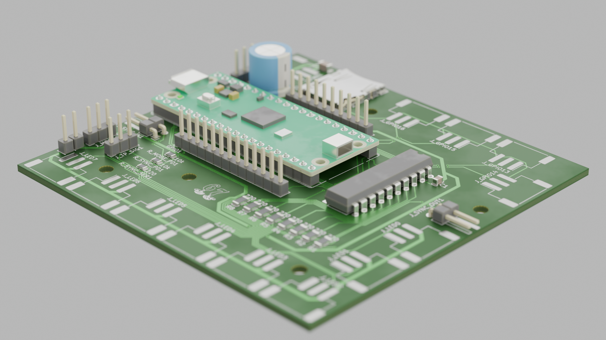
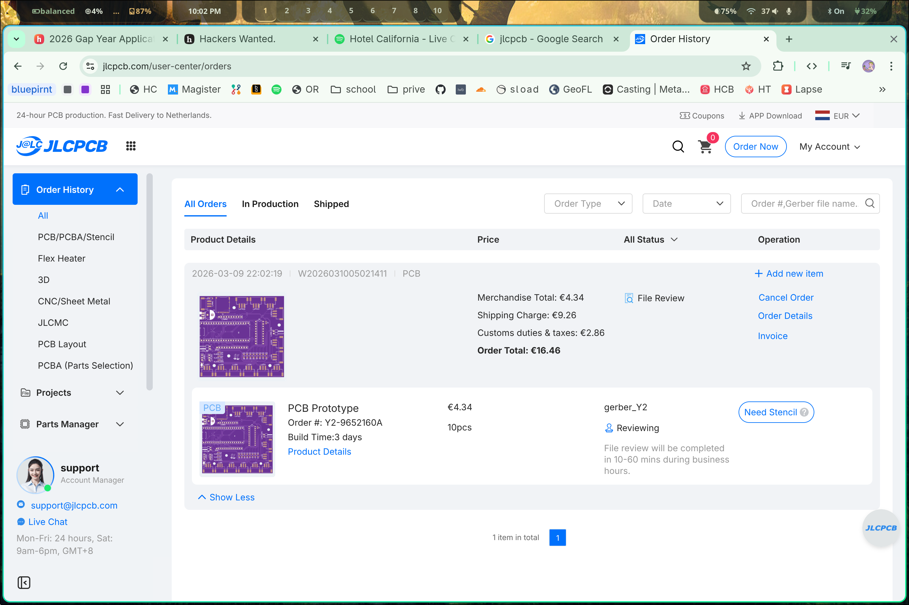
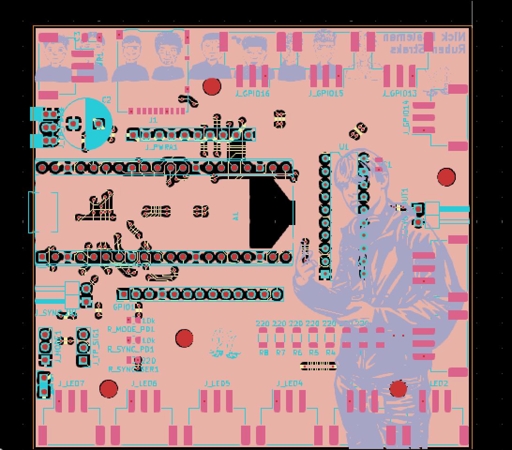
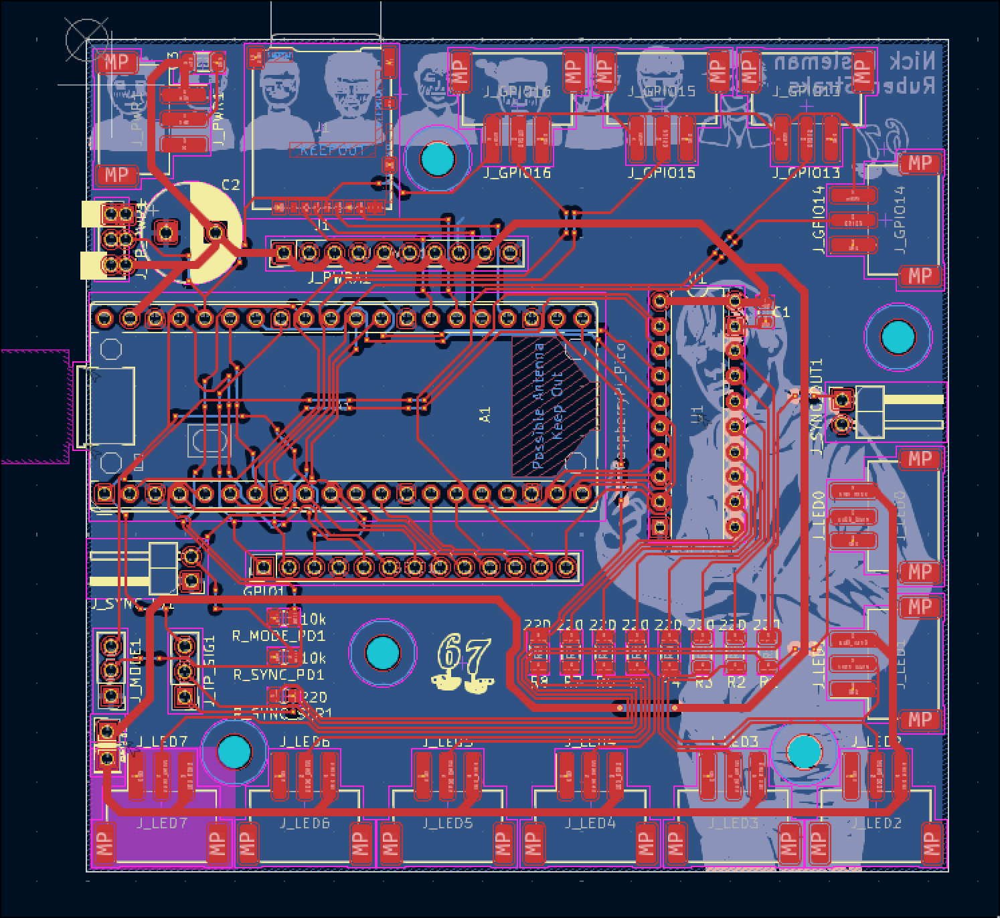
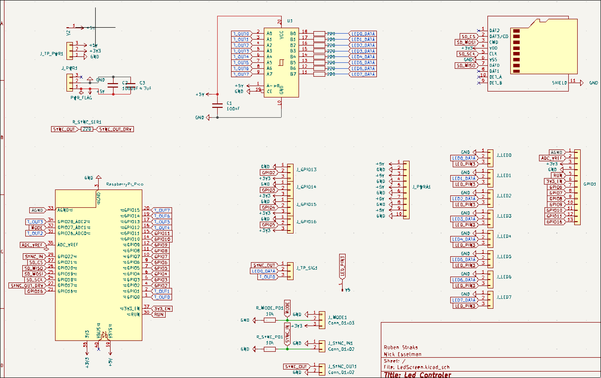
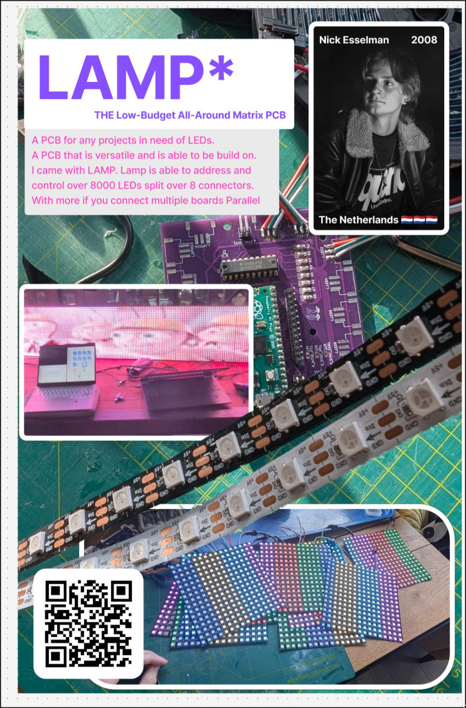
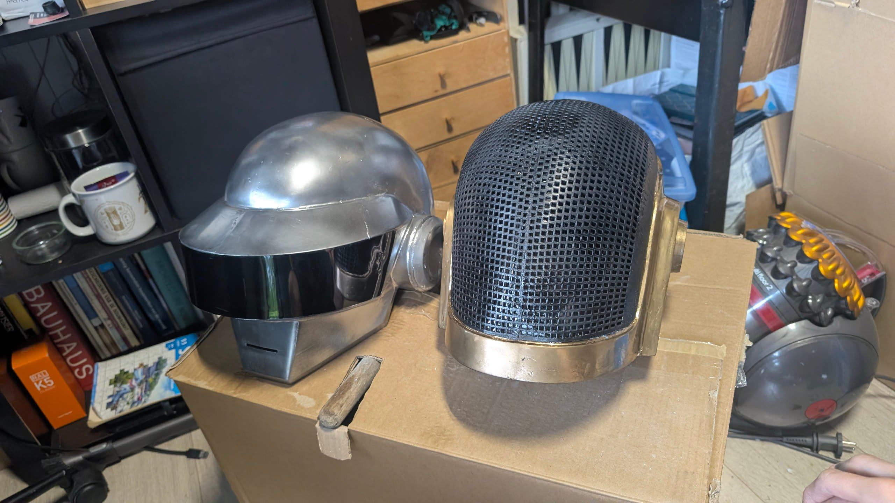
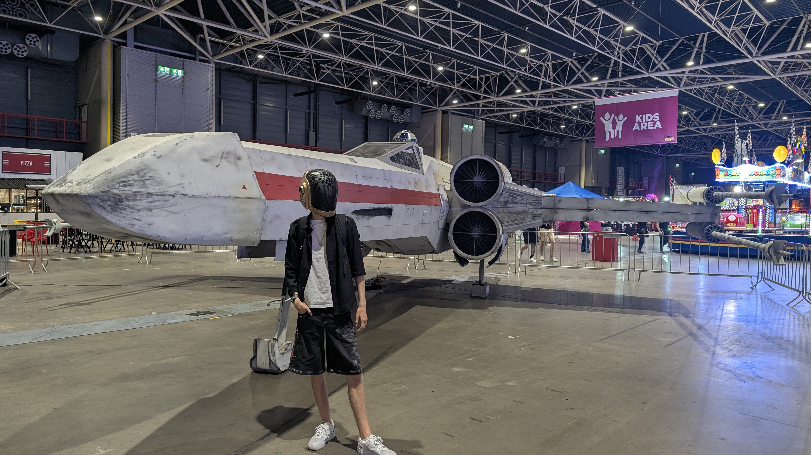
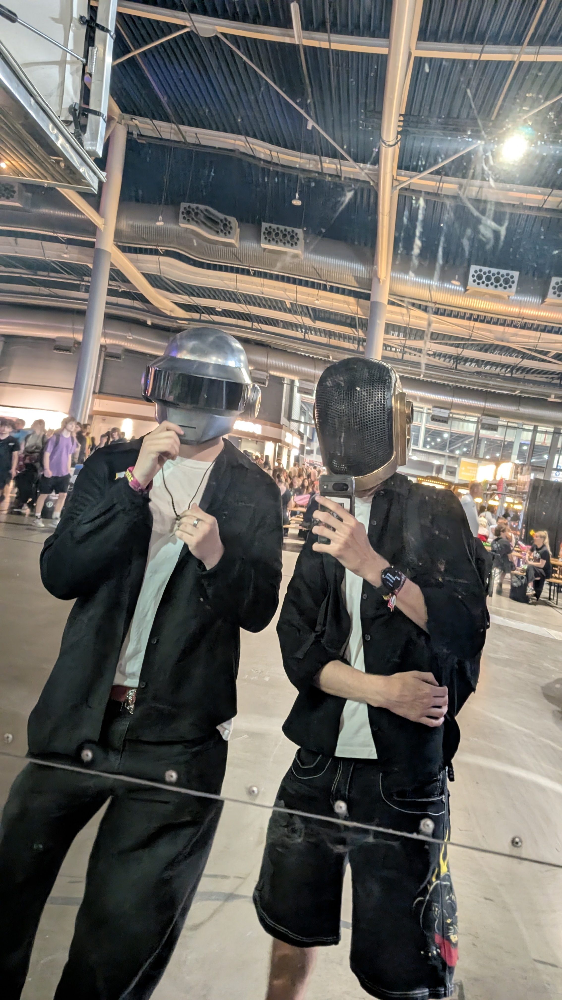
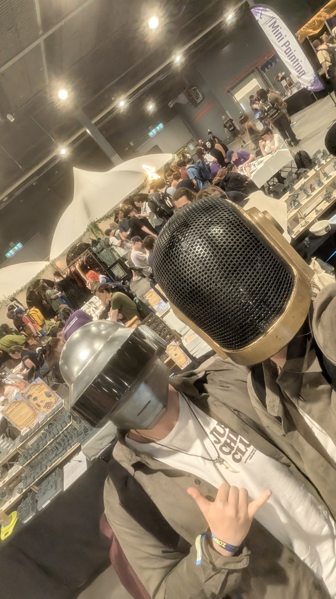

# Led Control Board
Status: PCB, Firmware, Hardware and examples are Completly done!

With this board you can control multiple WS2812 LED lines with XLight sequences.
The main idea is that I wanted one board that could handle the panel data, SD card playback, and animation syncing between boards. That i all achieved with this pcb.

## Project Purpose
### Why I Built This
One of my close friends, Ruben, wanted to build a big LED panel project with me so we could display text, animations, and more.
After this board is fully working, I also want to use it in 2 daft punk helmets for Comic-Con 2026.

### BOM
- Raspberry Pi Pico
- 74HCT245
- 1000uF Cap
- 8x 220 ohm Resistor
- 100nF Cap (optionaly)
- 4.7uF Cap (optionaly)
- 2x 10k Res (optionaly for board Sync)

## How do you use it?
If you want to update the code on the MCU, I would really suggest reading [The firmware instuctions](docs/FIRMWARE_INSTUCTIONS.md).
If you want to update the animations on the display, read [the animation instuctions](docs/ANIMATIONS_INSTUCTIONS.md).

The basic idea is:
1. Flash the Pico with the firmware from `arduino_firmware/Main/`.
2. Put `.lsa` animation files in the SD card root.
3. Connect the LED panels and power them from an external regulated 5V PSU.
4. If needed, chain multiple boards together with the sync in/out headers.

## Firmware / Software
The Pico runs my own firmware in the [`arduino_firmware/`](arduino_firmware/) folder.
To Install make sure you have the `Earle Philhower Arduino-Pico core board` library

### SD Card Playback
- The Pico firmware reads root-level `.lsa` files from a FAT32 SD card.
- Files named `startup*.lsa` play once at boot in case-insensitive alphabetical order.
- Every other `.lsa` file then plays in case-insensitive alphabetical order, repeating the complete playlist forever.
- Prefix normal files with numbers such as `01_intro.lsa` and `02_logo.lsa` to control their order.
- Long filenames such as `startup_1.lsa` are supported.
- USB live streaming and GIF playback are not part of the active firmware.

## Project Files
- [`pcb/src/`](pcb/src/LedScreen.kicad_sch) - PCB sourse
- [`pcb/exports/LedScreen.pdf`](pcb/exports/LedScreen.pdf) - exported schematic PDF
- [`pcb/exports/gerber.zip`](pcb/exports/gerber.zip) - gerbers bundled for fabrication upload
- [`pcb/Gerber/`](pcb/Gerber/) - individual gerber outputs
- [`pcb/bom/ibom.html`](pcb/bom/ibom.html) - interactive BOM
- [`mechanical/case/`](mechanical/case/) - case and standoff print files
- [`xlights_project/`](xlights_project/) - xLights example project for driving the board
- [`scripts/fseq_to_lsa.py`](scripts/fseq_to_lsa.py) - convert xLights FSEQ files to `.lsa`

## Notes
I also included an xLights example for controlling this board.
xLights configuration depends on the final data path used between xLights and the Pico.

Start with a smaller amount of daisy-chained panels per output lane while validating signal integrity and power behavior.
Use an external 5V PSU sized for the actual panel count and brightness.

## Bill of Materials
Interactive BOM: [cdn.nickesselman.nl](https://cdn.nickesselman.nl/ledpanel/ibom.html)

## Project Images

  
  
  
  

## Build Photos

## License
- Hardware: CERN-OHL-S
- Firmware/Software: MIT License
- 

# Daft Punk Helmets
I used this project for 2 Helmets, Guy manual (gold) & Thomas (Silver)
all 3d printed in about 200h of print time. and LED strips on the inside for the classic robot screen.
Models are in the repo and how i made this you can google and find on instrucables

